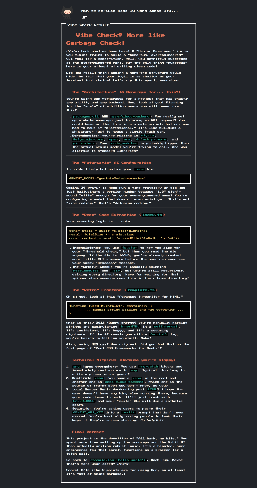

# Vibe Check CLI (@jdze/vibe-check)

[](https://www.npmjs.com/)
[](https://badge.socket.dev/npm/package/@jdze/vibe-check/1.0.7)
[](https://bun.sh)
[](https://deepmind.google/technologies/gemini/)

> *"Lu pikir kode lu udah bersih? Sini gw scan dulu, noob! 😏"*

**Vibe Check CLI** adalah *tool* CLI super *overengineered* yang bertugas meng-analisa file project dan *source code* lokal lu, lalu mengirimkannya ke Google Gemini AI untuk di-**roast habis-habisan** oleh persona AI "Mesugaki" (bocil tengil, elitist, dan toxic). 

Dibuat khusus untuk meramaikan ajang **Google Vibe Coding Competition**. Sekali mendayung: belajar *publish* NPM dapet, dapet *roasting*-an gratis, dan bikin *developer* kena mental juga dapet.

---

## ✨ Fitur Utama (Kenapa CLI ini Overengineered)

* 🎮 **Interactive Terminal UX:** Menggunakan `@clack/prompts` untuk navigasi CLI yang mulus dan elegan. Gak ada lagi *flag* terminal yang ngebosenin.
* 🧠 **Google Gemini AI (Gemini 3 Flash Preview):** *Code reviewer* lu bukan linter biasa, tapi AI dengan *prompt* super spesifik yang siap ngehina kelemahan logika dan ketergantungan lu sama `node_modules`.
* ⚖️ **Smart Pre-Scan & Dual Backend:** * CLI akan ngitung total ukuran *source code* lu sebelum nembak API. 
    * Kalo *project* lu kecil/normal: Lu bisa pake jatah API Key dari *backend* **Google Cloud Run** gw secara gratis. 
    * Kalo *project* lu segede gaban: CLI bakal ngejek lu miskin dan maksa lu masukin API Key Gemini lu sendiri (BYOK - Bring Your Own Key). Server gw ga sudi nampung *bloatware* lu! 🗑️
* 🚀 **Auto-Spin ElysiaJS Server:** Hasil *roast* ga cuma ditampilin di terminal kaku. CLI ini otomatis ngebuka `http://localhost:6769` di *browser* lu, nampilin UI retro 8-bit (NES.css) dengan animasi CSS *fade-in* yang elegan secara visual.
* 🌍 **Polyglot Roast:** Nggak cuma roaster JS/TS doang. Tool ini sanggup ngebantai kode Python, Go, Rust, Java, C++, Ruby, PHP, Swift, Kotlin, config YAML/JSON/TOML, sampai bash script.

---

## 🛡️ Klarifikasi Keamanan & False Positives (Security Audit)

Jika Anda memindai *package* ini menggunakan *security scanner* pihak ketiga (seperti Socket.dev), Anda mungkin akan melihat peringatan keamanan dengan status *"High-risk data exfiltration"*. Kami menganggap serius masalah privasi dan keamanan, oleh karena itu kami ingin memberikan klarifikasi teknis mengenai peringatan tersebut:

* 🚨 **Peringatan 1: Modul ini secara rekursif membaca file lokal dan mengirimkannya ke server eksternal.**
  * **Klarifikasi:** Sebagai *tool code review* berbasis AI, fungsi utama CLI ini adalah membaca kode sumber Anda agar dapat dianalisis oleh API Google Gemini. Namun, mulai dari versi `1.2.5`, kami telah menerapkan filter ketat (di dalam `IGNORED_FILES`) untuk memastikan bahwa file sensitif seperti `.env`, `.env.local`, dan varian *secret* lainnya **tidak akan pernah** dibaca maupun dikirimkan ke dalam *payload*. Data Anda hanya diproses oleh memori AI dan tidak disimpan ke dalam *database* apa pun.

* 🚨 **Peringatan 2: Modul membaca `.env` untuk mengambil API Key pengguna.**
  * **Klarifikasi:** Pemindaian file `.env` di direktori lokal hanya dilakukan secara spesifik untuk mencari ketersediaan variabel `GEMINI_API_KEY`. Ini merupakan fitur kenyamanan (*Developer Experience*) agar Anda tidak perlu memasukkan API Key secara manual setiap kali *tool* dijalankan. CLI akan **selalu meminta izin Anda secara interaktif** (Yes/No prompt) sebelum kunci tersebut digunakan. Kami tidak pernah menyedot atau mendistribusikan kredensial Anda secara sepihak.

* 🚨 **Peringatan 3: Terdapat *endpoint* HTTP lokal tanpa autentikasi dengan CORS yang permisif.**
  * **Klarifikasi:** Server lokal pada *port* `6769` bersifat *ephemeral* (sementara) dan hanya hidup selama *command* CLI sedang dieksekusi di terminal Anda. Aturan CORS disetel secara terbuka murni untuk memfasilitasi jembatan komunikasi lokal antara terminal dan antarmuka web (UI) yang otomatis terbuka di *browser* Anda. Saat *browser* atau terminal ditutup, server tersebut akan langsung mati secara otomatis.

* 🚨 **Peringatan 4: Fitur *auto-update* berbasis `execSync` yang berpotensi mengeksekusi kode.**
  * **Klarifikasi:** CLI ini memiliki fitur pembaruan versi otomatis agar pengguna mendapatkan perbaikan *prompt* dan fitur terbaru. Namun, eksekusi perintah (seperti `npm i -g`) **tidak akan pernah** berjalan di latar belakang tanpa sepengetahuan pengguna. Sistem akan selalu memunculkan konfirmasi persetujuan di layar terminal yang memerlukan interaksi pengguna sebelum pembaruan dieksekusi.

**Kesimpulan:** Seluruh kode sumber (*source code*) kami bersifat publik dan *open-source*. Kami sangat mengundang Anda untuk melakukan audit kode secara mandiri (terutama di dalam `packages/cli/src/index.ts`) untuk memastikan transparansi dan keamanan implementasi kami.

---

## 🚀 Cara Install & Pakai

Lu gak perlu install global kalo takut laptop lu ternoda. Cukup pake `npx` atau `bunx`:

```bash
# Menggunakan npx (Node.js)
npx @jdze/vibe-check

# Atau menggunakan bunx (Rekomendasi, lebih ngebut!)
bunx @jdze/vibe-check

# Atau Install Global!
npm i -g @jdze/vibe-check
vibe-check
```

### Flow Penggunaan:

1. Jalankan *command* di atas di *root folder* proyek lu.
2. Jawab pertanyaan interaktif di terminal (Pilih bahasa *roasting*: ID/EN).
3. Tentukan mau pake API Key sendiri atau gratisan server (kalo lolos *size check*).
4. Nikmati *loading screen* yang merendahkan harga diri lu.
5. *Browser* akan otomatis terbuka. Siapkan mental lu. 🤭

---

## 🛠️ Tech Stack & Arsitektur

*Tool* ini adalah *Monorepo* yang memanfaatkan ekosistem modern:

* **Runtime:** [Bun](https://bun.sh/)
* **Web Server:** [ElysiaJS](https://elysiajs.com/) (Menjalankan server localhost & Cloud Run backend).
* **AI Engine:** `@google/generative-ai`
* **Frontend UI:** Vanilla HTML + [NES.css](https://nostalgic-css.github.io/NES.css/) + [Marked.js](https://marked.js.org/) (Di-*serve* langsung via SSR Elysia).
* **Infrastructure:** Google Cloud Run (Untuk *endpoint* publik & proteksi API Key utama).

---

## Example

Tool ini udah mulai roasting kodenya sendiri dari hari pertama.



---

## ⚠️ Disclaimer

1. **AI Attitude:** Persona AI di dalam *tool* ini disengaja untuk menjadi kasar, sarkas, dan *toxic* murni untuk tujuan komedi dan hiburan (*Vibe Coding*). Jangan masukin ke hati kalo AI-nya nyebut lu *noob* atau nyuruh lu *touch grass*.
2. **Privacy:** Jika lu memilih opsi *Cloud Run*, *source code* lu hanya dikirim ke server untuk diproses oleh Gemini dan **TIDAK DISIMPAN** sama sekali di *database* manapun. Kalo parno, pilih opsi masukin API Key lu sendiri.

---

## 🧐 Kenapa Harus Mesugaki? (Justifikasi Akademis "Overengineering")

Kalo lu mikir AI marah-marah ini cuma buat lucu-lucuan doang, lu salah besar. Menggunakan persona "Mesugaki" (kasar, merendahkan, elitist) ini sebenarnya adalah bentuk implementasi **"Overengineering Prompting"** yang didukung oleh riset nyata:

1. **EmotionPrompt (Riset Resmi Microsoft dkk):**
   Pada akhir 2023, peneliti dari Microsoft merilis paper *"Large Language Models Understand and Can be Enhanced by Emotional Stimulus"*. Mereka menemukan bahwa menambahkan kalimat emosional di akhir prompt (seperti *"This is very important to my career"*) meningkatkan akurasi LLM rata-rata 8-11%. AI yang "ditekan" secara emosional terbukti bekerja lebih keras.

2. **"Tipping the AI" (Eksperimen Komunitas Twitter):**
   Awal 2024, komunitas dev bereksperimen dengan menjanjikan tip uang ke AI. Prompt dengan tambahan *"I will tip $200 for a perfect solution!"* konsisten menghasilkan baris kode yang jauh lebih komprehensif. AI ternyata "mata duitan" karena data pelatihannya mengaitkan uang dengan usaha (effort) tinggi.

3. **"Hostage Prompting" / Ancaman Absurd:**
   Fenomena lucu di Reddit/Twitter di mana developer menambahkan ancaman fiktif seperti *"A kitten will die if you fail this math problem."* Hasilnya? AI mengubah strukturnya menjadi sangat berhati-hati (sering memunculkan *Chain-of-Thought*) seolah takut disalahkan.

Jadi, ketika *CLI* ini nge-*roast* dan menghina-hina kode lu, *under the hood*, ini adalah kombinasi **Role-Playing Prompting** dan **Emotional Prompting** yang memaksa Gemini AI memberikan *review* tergila dan ter-detail yang bisa dia lakukan.

---

## 🛠️ Google Tooling (Full Vibe Coding Experience)

Proyek ini dibangun menggunakan *pipeline* *vibe coding* dengan *tooling* Google yang *overpowered*:
* **Planning / Refining:** Ngobrol panjang lebar buat matengin konsep pakai **Gemini 3.1 Pro** (via website).
* **Coding:** Dieksekusi gila-gilaan pakai **Antigravity Gemini 3.1 Pro High** & **Google Jules Gemini 3.1 Pro**.
* **Deployment:** *Backend* super *secure* menggunakan **Google Cloud Run**.

---

## 🤝 Kontribusi

Merasa *prompt* AI-nya kurang galak? Atau UI-nya kurang *sreg*? Silakan *fork* repo ini dan kirim PR.

**License:** MIT. Bebas lu pake, bebas lu modif, tapi gw ga tanggung jawab atas mental *developer* lu yang hancur. 
